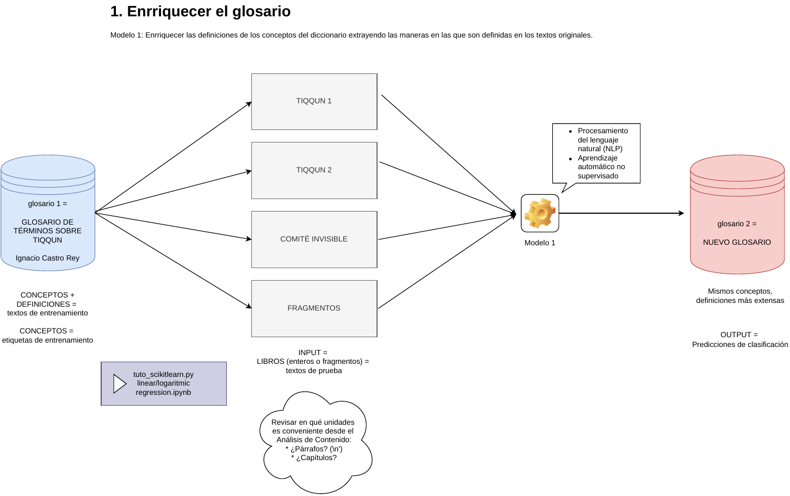
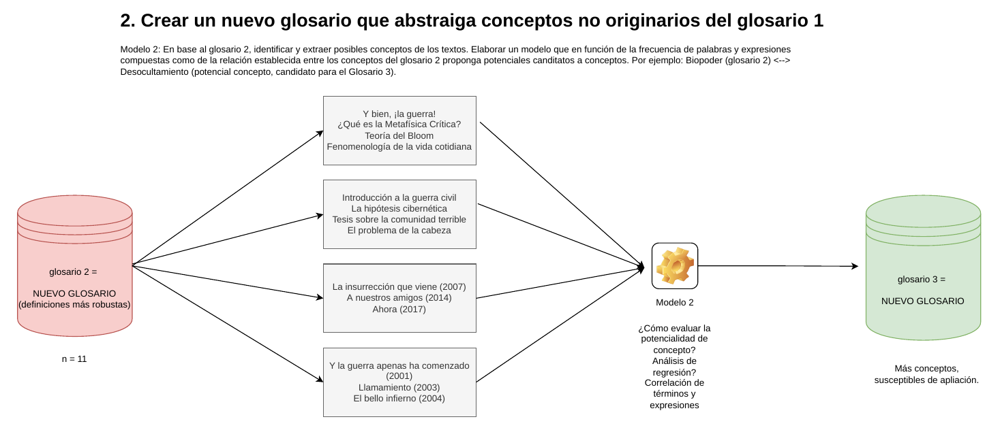
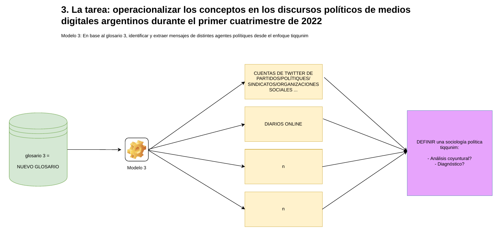

# Identificador/predictor de conceptos aplicando aprendizaje no supervisado

**work in progress**

---

Garriga, Jess. 2022.

FCPyS - UNCuyo.

Contacto: [garrigajess98@gmail.com](URL)

---

## Advertencia

El siguiente trabajo está en fase **work in progress** y tanto la metodología como los resultados obtenidos responden a una fase inicial y exploratoria de las herramientas. Queda evualar otros modelos, su desempeño y fundamentalmente la pertinencia de estos a los objetivos.

---

## Objetivos

* Identificar en un corpus de texto los conceptos de un glosario
* Enrriquecer el glosario inicial con los potenciales conceptos del corpus
* Construir un modelo que aplique el nuevo glosario más robusto a otras fuentes como redes sociales, cuentas de twitter, medios de comunicación, entre otras

## Descripción y motivación

El siguiente programa busca predecir/identificar conceptos teóricos en un corpus de texto bajo la aplicación de un modelo de machine learning bajo el paradigma del aprendizaje no supervisado. Este parte como una propuesta para mi equipo de investigación en la Facultad de Ciencias Políticas y Sociales de la Universidad Nacional de Cuyo. Trata de acercar herramientas de las Ciencias Computacionales a la Sociología, pero es potencialmente extendible al resto de las ciencias político-sociales.

## El modelo

Los textos de entrenamiento y sus etiquetas han sido elaborados a partir del [Glosario de términos sobre Tiqqun](http://www.ucm.es/centros/cont/descargas/documento38581.pdf) (Castro, 2012) y puestos a prueba con el libro [¿Qué es la metafísica crítica?](https://tiqqunim.blogspot.com/2015/05/metafisica.html) (tiqqunim, 2015).

Para la construcción del modelo se utilizaron los conceptos del glosario y sus definiciones en la elaboración de listas (los textos de entrenamiento y sus etiquetas) con el lenguaje de programación _Python_ (v. 3.8). Mediante la librería [scikit-learn](https://scikit-learn.com) vectorizamos dichos textos y aplicamos el método _fit_. Luego, vectorizamos el texto de prueba (el libro). Finalmente construimos un clasificador con el método _DecisionTreeClassifier_ y obtenemos las predicciones de X para Y.

## Resultados

Para cáda párrafo del corpus, el modelo predijo los siguientes conceptos:

`['Biopoder' 'Partido_Imaginario' 'Comunismo' 'Biopoder' 'Forma_de_vida'`
` 'Partido_Imaginario' 'Espectáculo' 'Espectáculo' 'Forma_de_vida'`
` 'Partido_Imaginario' 'Forma_de_vida' 'Bloom' 'Forma_de_vida'`
` 'Guerra_civil' 'Bloom' 'Guerra_civil' 'Partido_Imaginario'`
` 'Partido_Imaginario' 'Guerra_civil' 'Bloom' 'Forma_de_vida' 'Imperio'`
` 'Guerra_civil' 'Biopoder' 'Guerra_civil' 'Espectáculo' 'Guerra_civil'`
` 'Comité_Invisible' 'Partido_Imaginario' 'Forma_de_vida' 'Espectáculo'`
` 'Partido_Imaginario' 'Guerra_civil']`

La siguiente figura describe el proceso de predicción mediante un árbol de decisión:

## Conclusiones

El modelo debe ajustarse. El glosario puede enrriquecerse y mejorarse como sugiero en el apartado "Próximos trabajos". Los resultados pueden estar sesgados al 1) tratar de identificar conceptos no desarrollados en el corpus pero que se ven forzosamente aplicados por el modelo mismo y 2) las posibles carencias en las definiciones de los conceptos. Un glosario más robusto es fundamental para la aplicación de otros modelos cuales sean.

## Próximos trabajos

A continuación, presento bocetos de futuras líneas de trabajo en base a lo elaborado:

---

Para ejecutar el programa clonar el repositorio y correr `ml_id_conceptos.py`.

---

**Código escrito por Jess Garriga.**
